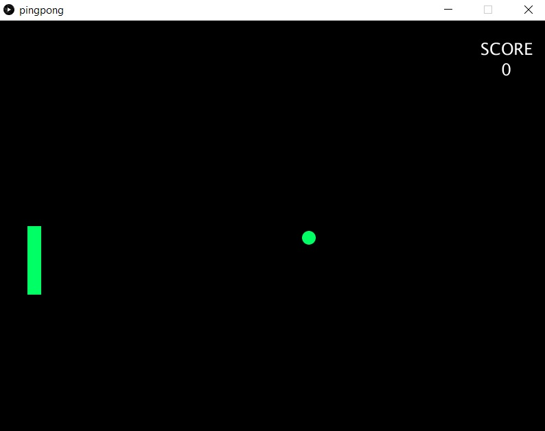

# Single Player Ping-Pong Game
  

For this assignment, I wanted to recreate a classic game in processing.  
This time I made use of classes which made the code more organized and clear to read.  
What I like the most about this approach is how scalable it feels.  
Most of the bits were relatively easy. However, to make the game more dynamic, I had to make sure that the ball wouldn't return in the same direction as it came.  
Therefore, I wrote a formula which would help me calculate the distance of the ball from the center of the player's board, and change the y velocity of the ball accordingly.
One should aim to make the ball land as near as possible to the center of the board.
````
float yforce = (b.ypos - (p.ypos + (p.pheight / 2)))/(pheight/2);
````
In order to give my game the retro feel I was looking for, I added some simple retro sounds from old games.
As time goes, the speed of the ball increases, making it harder to hit it.
The goal of the game is to see how long you last!

Video Gameplay: https://youtu.be/xmyv7Z0ra9U
