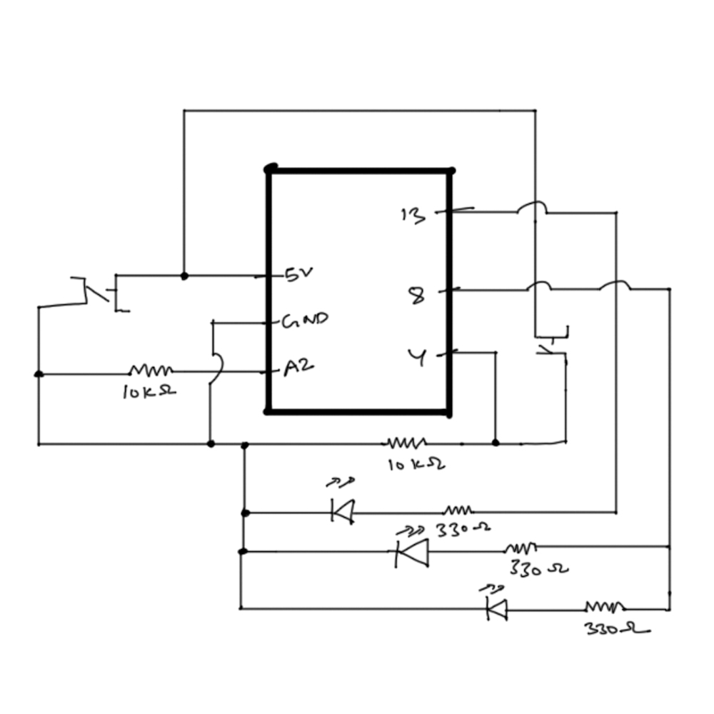

# LED Morse Code

In this assignment, I turned the LED buttons and switches to a small morse code device. The red button stands for 1 and the yellow button stands for 0 in the circuit. If we press 111000111 consecutively, which is the morse code for S.O.S, all the lights start blinking. If we want to reset our code at any point or stop the lights from blinking, we can press both the buttons together.
