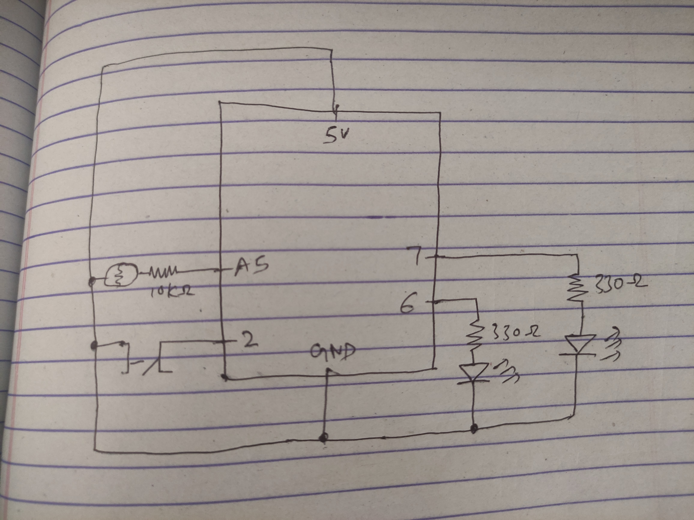
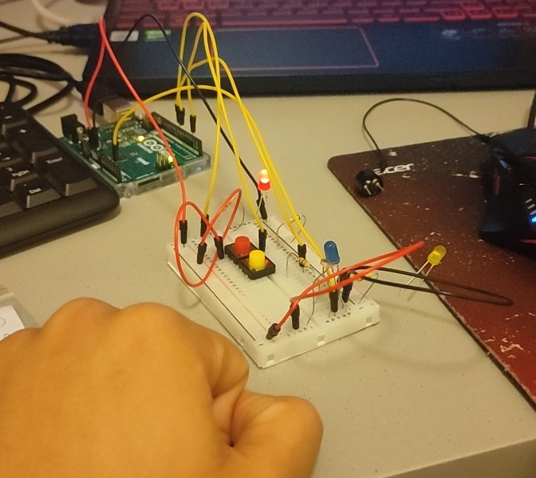

# Blinking Lights with LDR

Project at work: https://youtu.be/O9MkRaM0C2Y

In this project, I've made an arrangement where there are two leds. The job of the blue led is to provide light to the LDR sensor. The blue LED is controlled by a switch. I wanted to see how an LDR sensor would interact with the artificial light. 

When the blue light is turned on, the LDR's reading increases and the blinking in the red LED happens faster. The brightness of the red LED corresponds to the reading from the LDR as well. I achieved the fast faded/blinking effect by changing the increment with which the LED's brightness increases. 
