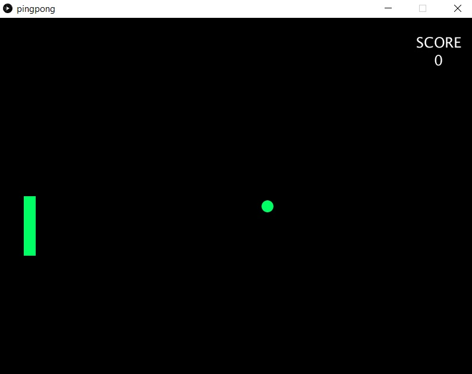

# Pingpong with Arduino
Working video: https://youtu.be/4CzHLhbNkI0




In this project, I modified the ping pong game I made on May 31 to make it work with Arduino. The circuit is really simple. It only composes of two buttons.
One button is used as an UP button for the game and the other is used as a DOWN button. If both buttons are pressed together, the game resets.

For the Serial communication, I am using the data that was being sent from the Arduino, but we had no interaction that required data from Processing in Arduino. Therefore, I just added a simple line that always sends the same value to complete the handshake.

```myPort.write(1);```


