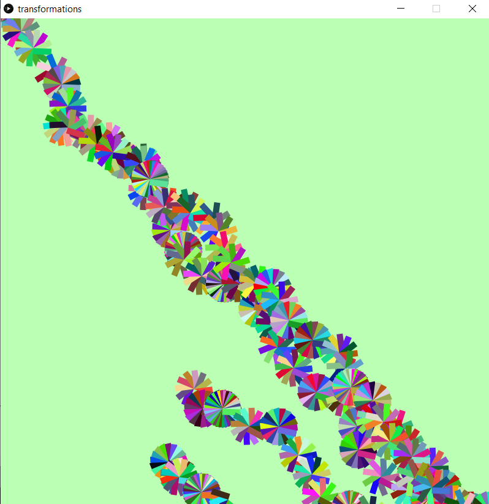
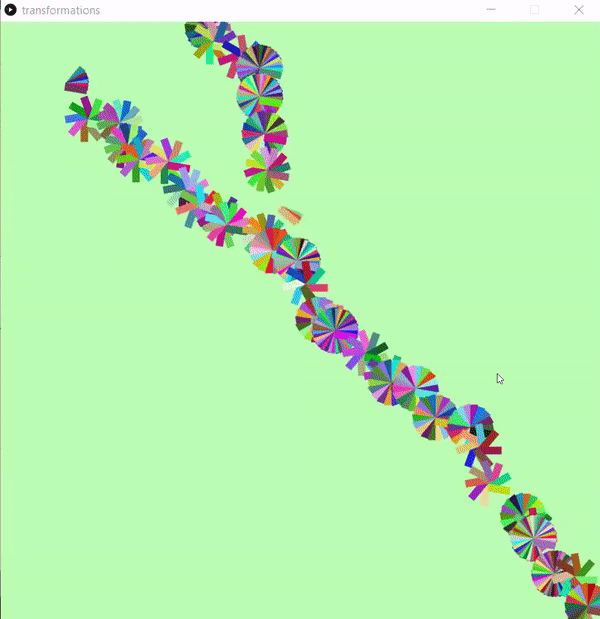

# Veins with Transformations

In this assignment, I wanted to create something with the use of translations and rotations.  
I was inspired by Professor Sherwood's project too, so I wanted to do something that made use of angles and randomization.  
I made use of the processing functions and classes to create this vein-like randomized art.  
It looks very organic, like something that is growing in nature.

Here is a gif of how it works:

