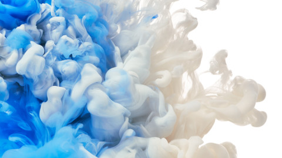
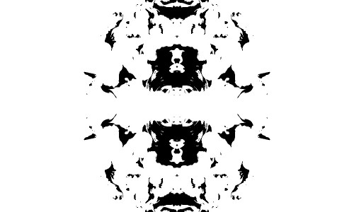
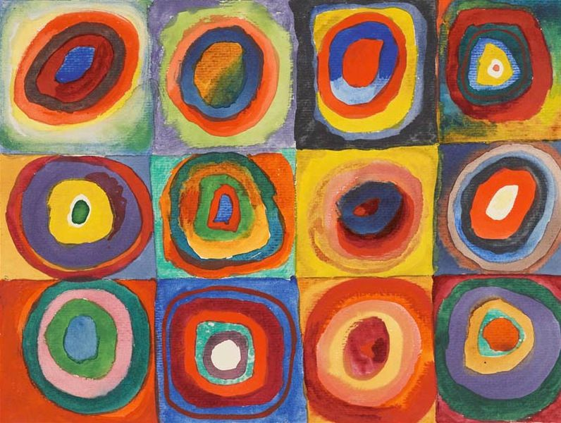
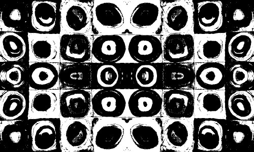
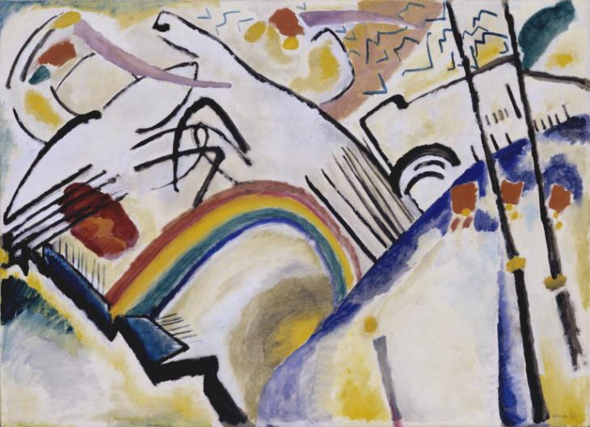
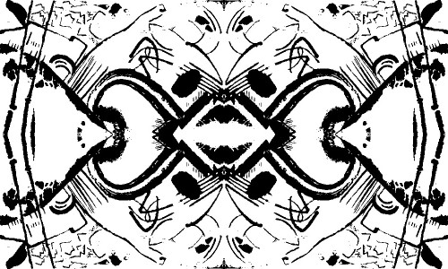
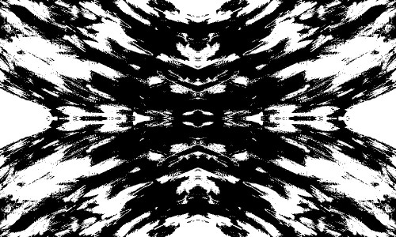
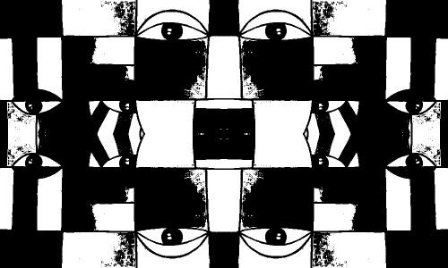
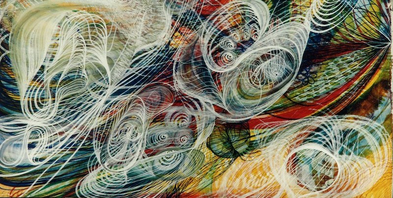
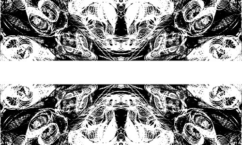

# Print and Mirror Effect

In this artwork, I made use of images and the pixels array to come up with a printed/mirrored-effect in processing.  
When provided with any image (I chose abstract art), the sketch converts the image into black and white by going through each pixel and converting it into black or white depending upon its brightness value. Then, I used that output and arranged it into a 4-way symmetry across the canvas to come up with the final mirrored effect.

I got some interesting results. The first is the image and the second is the output in each of the following sections.

### Image 1: 
 

### Image 2:
 

### Image 3:
 

### Image 4:
 

### Image 5:
 

### Image 6:
 
