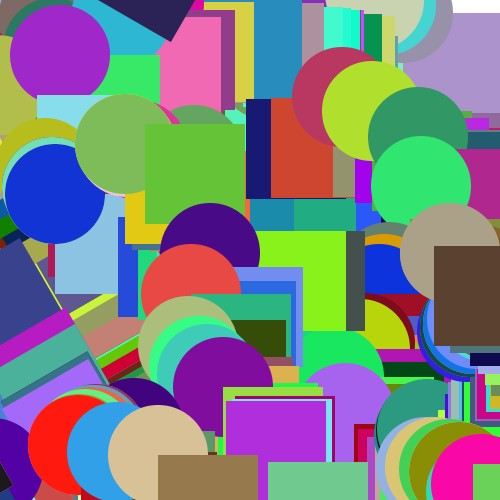

# Generative Art
In this assignment, I tried to make the art random. The shapes that are created are generated randomly when the mouse is hovered around the canvas.
Their colors are also selected on a random basis.

Instead of making a static image, I decided to make use of the mouse to make the design.
Using loops didn't feel straightforward because it felt as if the same thing could be done with an if condition in most cases.
However, I decided to use it which gave a more interesting effect at the end where multiple shapes pop out in one stroke.

