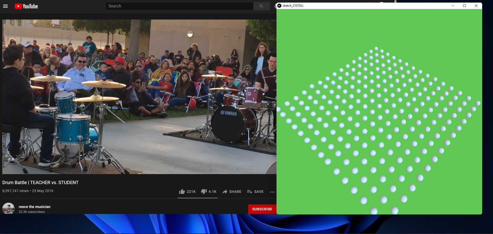

# Performance Visualizer

Working Video: https://youtu.be/UFdXePEe8Yk  
Working Video 2: https://youtu.be/ESUuAlLhuow

## Images


## Description
In this project, I'm visualizing audio in 3D space in processing. Moreover, the visualization depends on the environment as well. There is an LDR sensor connected to the arduino which provides data to the processing sketch. This sensor can simulate lights getting turned off in the club for example. 
My inspiration for the art style of the project comes from this video: https://youtu.be/WEBOTRboXBE

## In Arduino...


✅Analog Read  
✅Analog Write  
✅Digital Read  
✅Digital Write  

The arduino sketch consists of one LDR sensor, a switch, a RGB light, and a red LED light. When the switch is pressed, the arduino goes into the "on" state, and the processing sketch starts taking input from the environment. The red LED light is turned on when the processing sketch is paused, and it turns off when we continue the visualization by pressing the switch. The LDR sensor sends the light data to processing. Moreover, the RGB light corresponds to the background color of the processing sketch that keeps changing.

## In processing...

✅Drawing with primitives  
✅Transformations  
✅Animation  
✅Sound  

The processing sketch makes use of the sound library to take user input. Then, the sketch analyzes the audio by using the built-in Fast Fourier Transform(FFT) method.
```
float[] spectrum = new float[512];
fft = new FFT(this, bands);
...
fft.analyze(spectrum);
```
Then, the value of each single frequency is mapped to the z-index of the spheres that appear on the screen. Moreover, if the audio is strong enough and the z-index crosses a certain threshold, the whole grid of spheres starts rotating.
```
rotateX(radians(rotation));
rotateZ(radians(80 - rotation));
        
if (gameState == 0) {
  z = 0;
} else {
  if (size > 0.8 && rotation >= 0) rotation -= rotationInc * 2;
  else {
    if (rotation < 80) rotation += rotationInc * 2;
  }
}
```
Here, gameState is the value sent by arduino. The value of `gameState` determines whether or not we'll be performing any kind of changes to the spheres.

The directional light on the spheres changes depending on the cursor.

At the end, we extract the r, g, b values from the background color...
```
r = c >> 16 & 0xFF;
g = c >> 8 & 0xFF;
b =  c & 0xFF;
```
...and sends it to arduino.  
```myPort.write(int(r) + "," + int(g) + "," + int(b)+"\n");```
