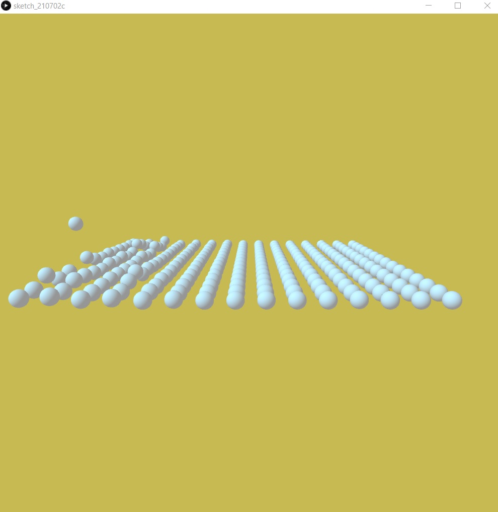

## June 29:
For the final project, I intend to make use of the user's sound to control a game. This project will have multiple ways for the user to affect the game state. The primary interaction will be with the user's sound, but the user can also use potentiometers, buttons, and other sensors to create the artwork or play the game. For example, the user can increase or decrease the sensitivity of the game with the potentionmeter. 

My inspiration comes from games like these: https://www.youtube.com/watch?v=ykKor95hcCs

## July 1:
I'll be building off of the AuidoIn example given in processing. The idea is pretty straightforward. Today, I plan to finish the basic dynamics of the game. Moreover, I plan to start sketching a rough plan of how the circuit is going to look like.

## July 3:
I made some changes to the final project. Rather than making a game, I decided to make an Audio visualizer. More than an Audio visualizer, the idea behind the project is to make it a 'Performance Visualizer'. 

The project is going to be 3D. The audio is visualized with the help of moving spherical objects. I am taking the audio input from the user and using the built-in Fast Fourier Transform method to get information about each single frequency. Then, the frequency is mapped to the z-index of the spherical objects. The color of the background changes and the grid of spherical objects rotates as the audio is played.

My inspiration for the art style of the project comes from this video: https://youtu.be/WEBOTRboXBE

In terms of the arduino circuit, I'm going to use the distance sensor to space out the distance between the spheres. Moreover, I'll try to map out the color of the background with a RGB light on the arduino.

## July 5:
Finished most of the serial communication today. I am getting all the required values both in processing and arduino. The color of the RGB light changes as the background color of the visualizer changes in processing. I faced some issues while parsing the r, g, b integer values, but I figured it out at the end. All that's left now is to make changes in processing with the values that I'm getting from arduino right now.

## July 6:
I've finished implementing the sensor data in the processing sketch. The performance visualizer is ready.
