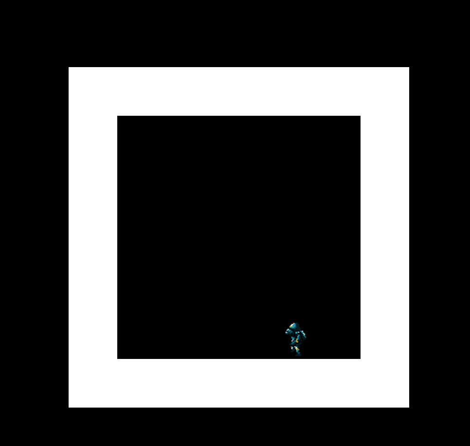
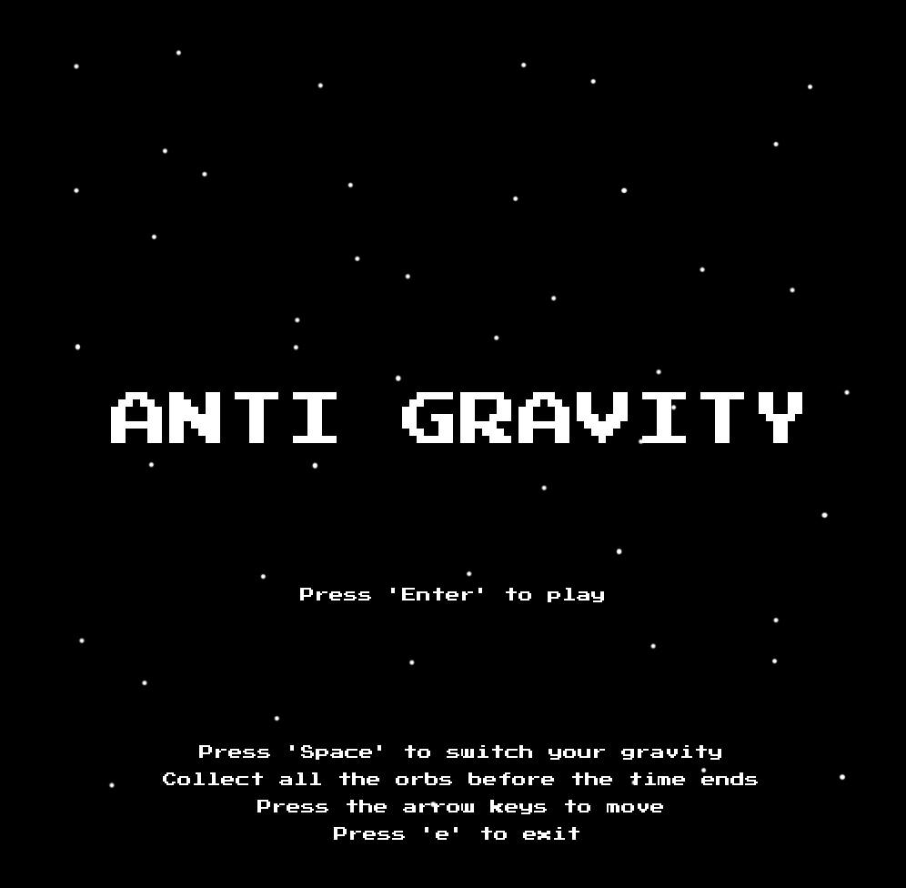
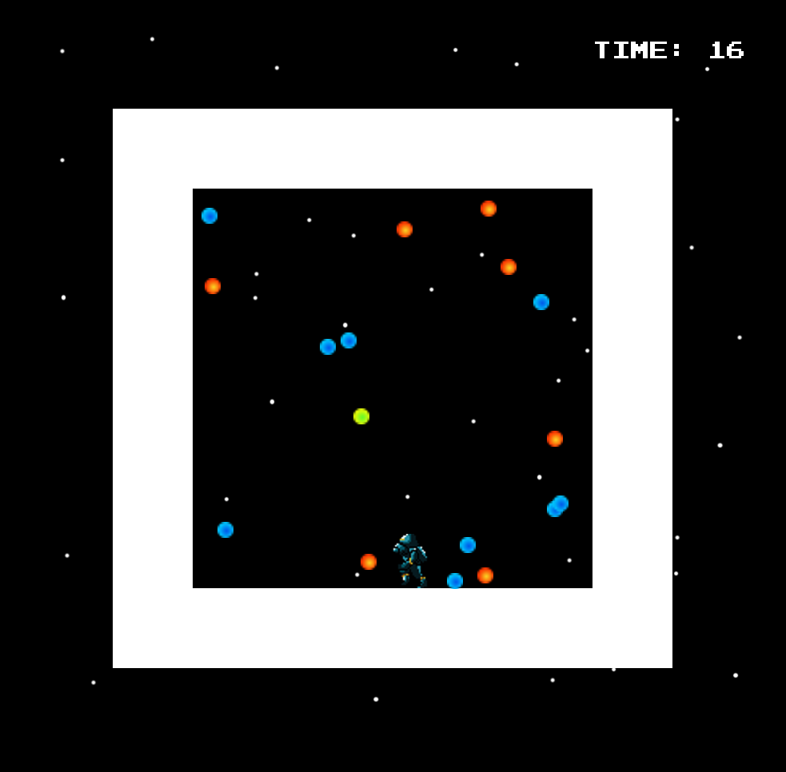
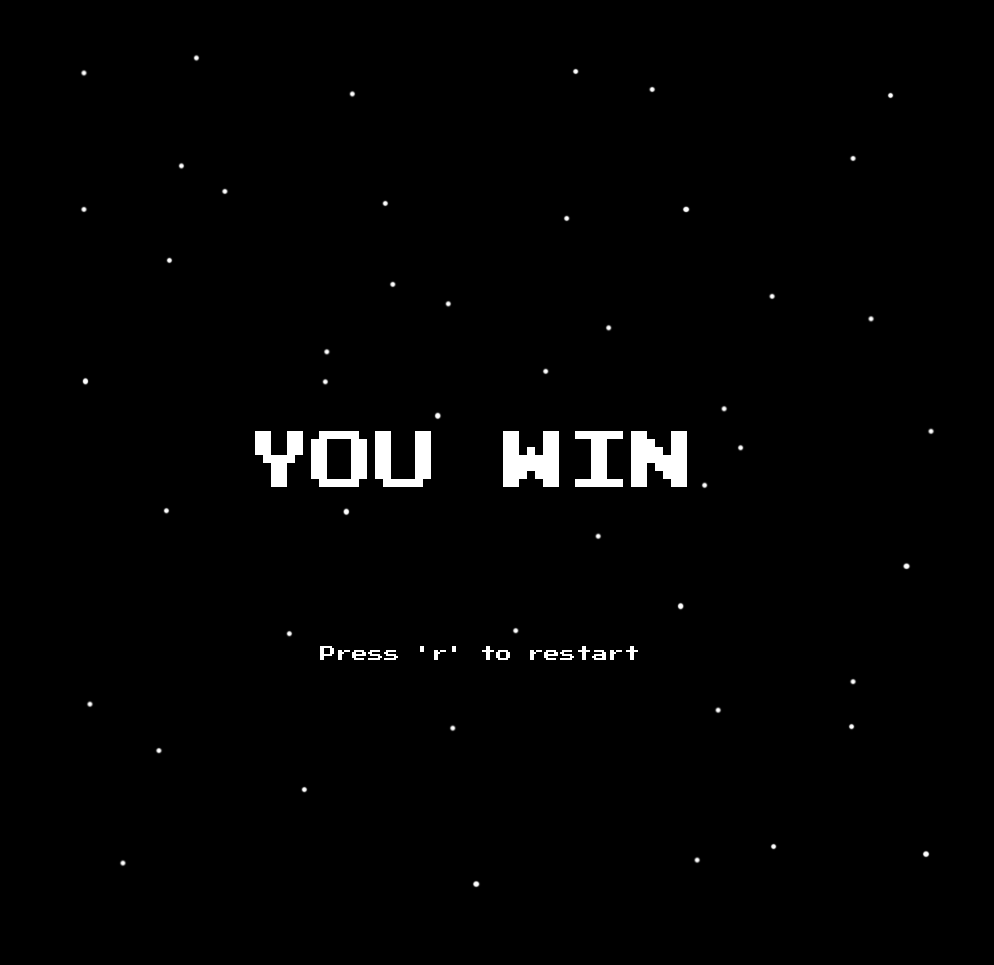
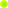

# Midterm Project
### June 8:
I have come up with a concept for a simple game that allows the player to manipulate gravity. The game will include a square platform on which the user can jump around on any side, trying to avoid obstacles while collecting as many points as possible.


Finished making the platform for now, which comprises of 4 separate rectangles.

### June 9:
I added the Player class, and the Player is visible on the screen for now. I've also added the collilsion mechanism.

```
boolean collides() {
  // depending on the position of the four rectangles
  if (y > (height - game.boxHeight)/2 + game.borderWidth && y + chHeight < (height + game.boxHeight)/2 - game.borderWidth 
    && x > (width - game.boxWidth)/2 + game.borderWidth && x + chWidth < (width + game.boxWidth)/2 - game.borderWidth) {
    return false;
  }
  return true;
}
```

I've also added gravity to the game, but it is going to be a bit tricky since I'll be changing the gravity in four different ways. I'm planning to work on that and the game Controls next. This is what it looks like until now.



### June 13:
#### DAY OF COMPLETION

#### Game Concept
I stayed true to the original concept that I came up with on June 9, but I changed the game dynamics a bit. Now, the player needs to collect the orbs before a certain amount of time. Otherwise, they lose. There were a lot of complications while implementing this gravity manipulation concept, but it worked out at the end.

#### Game Controls
The user can move left or right and up or down, depending on their orientation, with the arrow keys. The user can change their orientation by pressing 'space'. The orientation changes from 0 (gravity pulling downwards), 1 (right), 2 (up), 3 (left), and back to 0 again. The user needs to press Enter at the main menu to start playing, and they can restart by pressing 'r' at the end screen. The user can exit the game at any time by pressing 'e'.

#### Game States
Mainly, there are three screens that are in the game that is kept track of by a string in the Game class.

```String state = "menu";  // there are three states: menu, play, and over```

##### Main Menu : "menu" state



##### Playing : "play" state



##### Game Over: "over" state



The orbs are of different colors.

  

I just wanted a bit of variety.

#### Orientation
Then, the main part of the program was changing the orientation of the player. This project was a bit complicated because of the various orientations that a character can be in. There were multiple factors like collision, gravity, acceleration, restraints, loading the image, etc. that had to be taken care of for each orientation. Therefore, I made an anchorPoint to keep track of the top left of the image despite its orientation. This made things like collision handling a bit easier. I had to set up a proper relation between the actual x and y values of the image and the anchor point.

```
if (orientation == 0) {
  anchorX = x; 
  anchorY = y;
} else if (orientation == 1) {
  anchorX = x; 
  anchorY = y - chHeight;
} else if (orientation == 2) {
  anchorX = x - chWidth; 
  anchorY = y - chHeight;
} else if (orientation == 3) {
  anchorX = x - chWidth; 
  anchorY = y;
}
```

#### Font
I'm using a retro font that I found in 

#### Sounds
I'm using the minim library to take care of the sounds in the game. There are two sounds, one for the background and the other for picking up the orbs. The background sound keeps playing in a loop. 

#### Images
I made the starry background and the orbs by myself in Photoshop. I used the sprite from a free website. The pixelated character fits to the look and feel of the game.

Overall, the project felt quite complex and it took a bit of thought to materialize it, but I'm glad to have chosen this concept.


