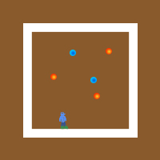

# Midterm Project
### June 8:
I have come up with a concept for a simple game that allows the player to manipulate gravity. The game will include a square platform on which the user can jump around on any side, trying to avoid obstacles while collecting as many points as possible.



Finished making the platform for now, which comprises of 4 separate rectangles.

### June 9:
I added the Player class, and the Player is visible on the screen for now. I've also added the collilsion mechanism.

```
boolean collides() {
  // depending on the position of the four rectangles
  if (y > (height - game.boxHeight)/2 + game.borderWidth && y + chHeight < (height + game.boxHeight)/2 - game.borderWidth 
    && x > (width - game.boxWidth)/2 + game.borderWidth && x + chWidth < (width + game.boxWidth)/2 - game.borderWidth) {
    return false;
  }
  return true;
}
```

I've also added gravity to the game, but it is going to be a bit tricky since I'll be changing the gravity in four different ways. I'm planning to work on that and the game Controls next. This is what it looks like until now.


