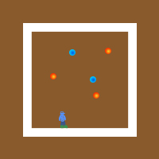

# Midterm Project
June 9: I have come up with a concept for a simple game that allows the player to manipulate gravity. The game will include a square platform on which the user can jump around on any side, trying to avoid obstacles while collecting as many points as possible.

